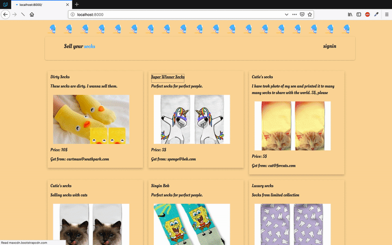

# SellingSocks

Feel confident about your future, now you will always have a place where you can sell your socks!

# Software requirements

You will need Python 2.7, Flask and Sqlalchemy to run this application. 
1.  You can either install vagrant and virtual box along with getting configuration by cloning this [file](https://github.com/udacity/fullstack-nanodegree-vm/blob/master/vagrant/Vagrantfile). Make sure to `vagrant up`  and `vagrant ssh` before running the application.
2. or you can try to configure your own computer via following stepes.
* Install pip and Python 2.7 
* `pip install -r requirements.txt`

# Getting Started

Please, run before program start this script to populate db:
* `python populate_socks_db.py`

Run application
* `python application.py `

View page in browser
* `http://localhost:8000/`

# API

You can view json representation of any item in this catalog!

To get data regarding all socks:
* `http://localhost:8000/socks/JSON/`

To get data about one sock with sock_id being an id of already existing sock:
* `http://localhost:8000/sock/sock_id/JSON/`

# Demo

# References

This course was developed as a part of Udacity Full Stack Web Development Nanodegree Course and according to tutorial lessons of the course.

# Credits

Thanks to Udacity and Full-Stack Web Develeoper mentoring team! I really enjoyed learning from you. Reviews and support you provide are very inspirational  throughout the whole course :)

